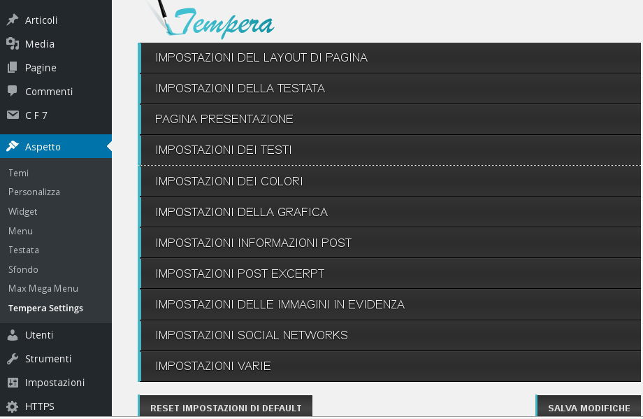

#Gestione del tema grafico (per i siti di zona)

In ambiente Wordpress un tema consiste nell'aspetto del sito, nella sua interfaccia grafica, nel modo in cui esso viene visualizzato dall'utente.

Esiste una vastissima quantità di [temi per Wordpress](https://wordpress.org/themes/); ne consigliamo uno in particolare, già installato e configurato sul sito ([tempera](https://wordpress.org/themes/tempera/)).

##Personalizzazione di Tempera
Per andare a personalizzare il tema consigliato utilizziamo il menu di sinistra della nostra dashboard posizionandoci su "Aspetto" e cliccando su "Tempera Settings".
  

####Impostazioni del Layout di Pagina
Scegliendo la riga "Impostazioni del Layout di Pagina" possiamo modificare la struttura delle pagine del nostro sito, ovvero: il contenuto sviluppato su una colonna, su due colonne con a destra una barra verticale, su due colonne con a sinistra una barra verticale e così via...
Possiamo anche regolare la larghezza che avrà il nostro sito con la barra apposita.  
  

####Impostazioni della Testata
Le "Impostazioni della Testata" riguardano la parte superiore del sito (header), nello specifico l'area contenente il logo.  
  
Possiamo ora modificare il logo che comparirà nella parte superiore di ogni pagina del sito scrivendo il link dell'immagine scelta (vedi "altri contenuti 